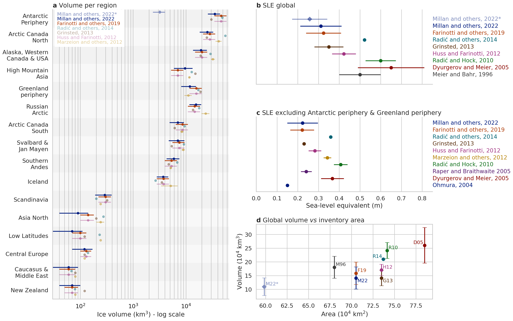
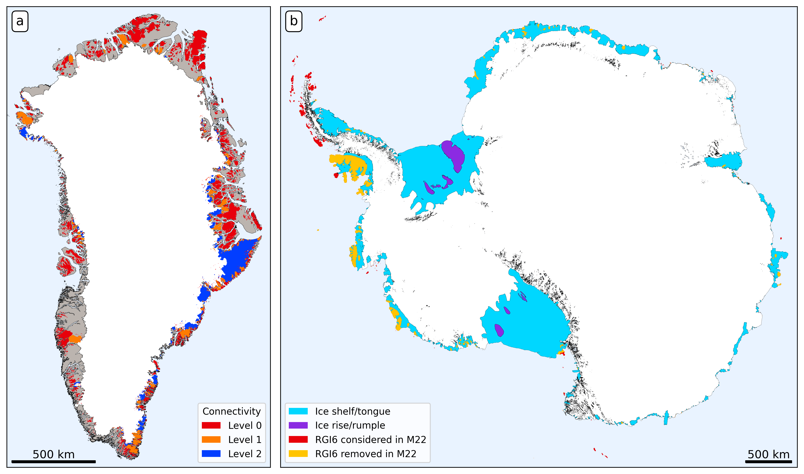

# Global glacier volume figures

A recent study by [Millan et al. (2022)](https://www.nature.com/articles/s41561-021-00885-z) provides new estimates of the volume of glaciers worldwide.

While the study is a tremendous improvement in methodology as well as fantastic new openly available dataset, their Table 1 and its correct interpretations is made difficult because of two aspects related to data coverage. This has important consequences for potential users of the data: we attempt to clarify these points in a paper submitted to Journal of Glaciology (currently in review) and in this code & data repository.

## Figures

Used in the paper:

## Corrected regional and global volumes

In the `data_regional_correction` folder, you will find to CSV files.

### Glacier per glacier volume 

`all_glaciers_m22_f19.csv` contains the individual glaciers' volume estimates as provided by the [Millan et al. (2022)](https://www.nature.com/articles/s41561-021-00885-z) (M22) and [Farinotti et al. (2019)](https://www.nature.com/articles/s41561-019-0300-3) studies. To compute the M22 estimates, reprojection and subsetting of the original M22 files was necessary - we did this with the OGGM framework [Maussion et al., 2019](https://gmd.copernicus.org/articles/12/909/2019/).

The M22 thickness data is available from [this website](https://www.sedoo.fr/theia-publication-products/?uuid=55acbdd5-3982-4eac-89b2-46703557938c), the F19 data from [this one](https://www.research-collection.ethz.ch/handle/20.500.11850/315707).

Details of the columns:
- `index`: RGI ID (RGI v6)
- `millan_vol_km3`: the volume of the glacier as computed from the original M22 dataset 
- `millan_area_km2`: the area covered by the dataset in this glacier as computed from the original M22 dataset 
- `millan_perc_cov`: the percentage of the glacier covered by the original M22 dataset 
- `f19_vol_km3`: the volume of the glacier as obtained from the original F19 dataset 
- `millan_vol_adj`: the volume of the glacier as computed from the original M22 dataset, but adjusted for regional undercatch (pixels non-attributable to a specific glacier). This is not a correction for the missing area, but necessary to match the regional volume estimates. The difference to  `millan_vol_km3` is small (< 5% in most cases)
- `vas_millan_vol`: the volume as computed by volume area scaling, regionally fitted to all glaciers with > 90% coverage

### Corrected regional volumes

In `millan_table_corrected.csv`, we revise Table 1 in the paper on three aspects:
1. The values indicated in both the F19 and M22 publications are rounded for readability, which makes certain numbers in small regions too coarse for comparison and exact percentages. Here the numbers are directly extracted from the original data files of each respective study.
2. Region 19 (Antarctic and Subantarctic) is now considered as a whole, like in F19
3. The regional volumes are corrected for missing data coverage in the M22 product. For this correction, we use two different methods (see paper).

See the code in [millan_regional_volume_scaling.ipynb](millan_regional_volume_scaling.ipynb) for more details.

Details of the columns:
- `RGI area (km²)`: total glacier area in the region as provided by the RGI dataset
- `M22 area uncorrected (km²)`: total glacier area in the region covered by the M22 dataset
- `M22 coverage (%)`: the area coverage in the M22 dataset, as computed by dividing `M22 area uncorrected (km²)` by `RGI area (km²)`. These numbers should be close to (but not identical to) Table 1 in M22, because they report velocity coverage, not thickness.
- `M22 volume uncorrected (km³)`: total volume of the region provided by the M22 dataset (without correction). These numbers should be identical to M22 Table 1 (they are not exact in some cases, but close enough - we assume rounding or small reporting errors in the paper).
- `F19 volume (km³)`: regional volume in the F19 dataset.
- `M22-F19 volume difference uncorrected (%)`: the difference in volume as reported in Table 1 of M22, but computed by us by dividing `M22 volume uncorrected (km³)` by `F19 volume (km³)`. The numbers should be close enough.
- `M22 volume on subset (km³)`: the total M22 volume on the subset of glaciers with M22 data coverage > 95% (i.e. good quality of both datasets)
- `F19 volume on subset (km³)`: the total F19 volume on the same subset
- `M22-F19 volume difference on subset (%)`: the difference in volume computed over the same subset 
- `M22 volume corrected method 1 (km³)`: the corrected regional volumes, computed with Method 1 (linear scaling of the missing volume by the missing area)
- `M22 volume corrected method 2 (km³)`: the corrected regional volumes, computed with Method 2 (using F19 to estimate the fraction of the volume not covered by M22)
- `VAS parameter c`: the regional parameter `c` in the volume area scaling `V` = `c A^gamma`. Fitted over all glaciers in the subset.
- `VAS parameter gamma`: the regional parameter `gamma` in the volume area scaling `V` = `c A^gamma`. Fitted over all glaciers in the subset
- `M22 volume corrected method 3 (km³)`: the corrected regional volumes, computed with Method 3 (using volume-area scaling to estimate the fraction of the volume not covered by M22)
- `M22-F19 volume difference method 1 (%)`: the new regional differences (in %) computed with Method 1
- `M22-F19 volume difference method 2 (%)`: the new regional differences (in %) computed with Method 2
- `M22-F19 volume difference method 3 (%)`: the new regional differences (in %) computed with Method 3

## Licence 

It's all coded in python 3. You'll need pandas, geopandas, matplotlib, and seaborn for this to work.

The code is released under BSD3. The regional volume data is **not** from us but from the respective studies. 

**If you use the data in the `data` folders, please refer to the original studies.**

**If you use these plots or the data in the `data_regional_correction` folder, please refer to** *Hock R., Maussion, R., Marzeion, B. and Nowicki, S., 2022: What is the global glacier ice volume outside the ice sheets?, Journal of Glaciology, submitted.*
