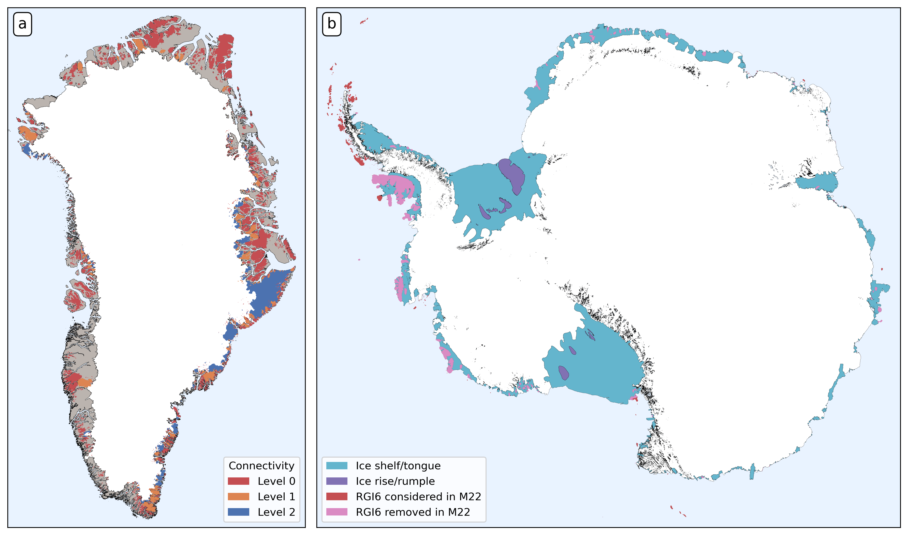

# Global glacier volume figures

Code & data necessary to make the following figures:

It's all coded in python 3. You'll need pandas, geopandas, matplotlib, and seaborn for this to work.

The code is released under BSD3. The volume data is **not** from us but from the respective studies. If you use the data in the `data` folders, please refer to the original studies.

**If you use these plots**, please refer to *Hock R., Maussion, R., Marzeion, B. and Nowicki, S., 2022: What is the global glacier ice volume outside the ice sheets?, Journal of Glaciology, submitted.*
